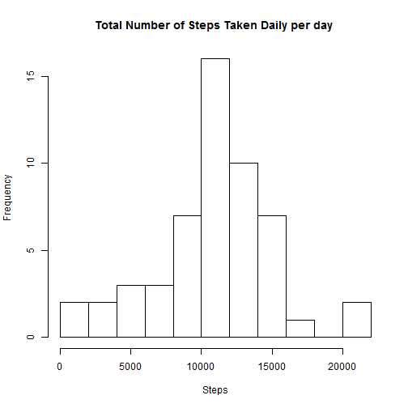
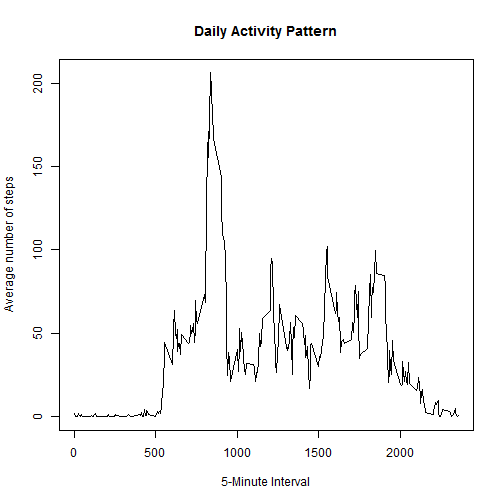
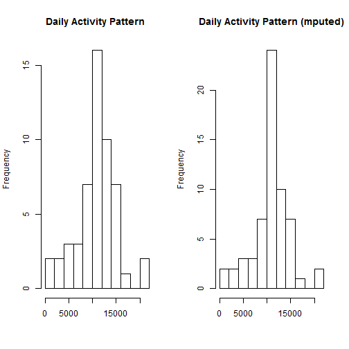
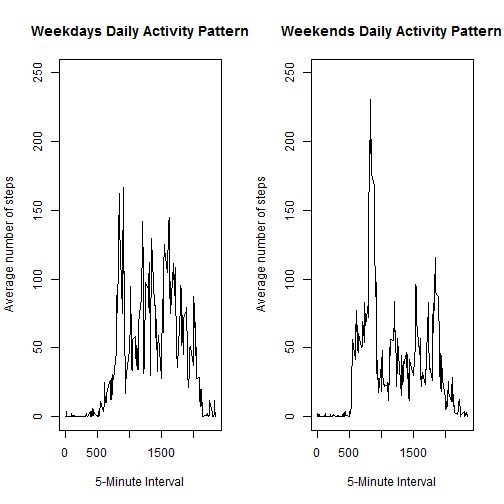

#Reproducible Research Assignment 1

###Part1 - Read in Datasets

```r
setwd("C:/Users/Krystal/Documents")
activity<-read.csv("activity.csv")
activity$date <- as.Date(activity$date)
```


###Part2 - What is mean total number of steps taken per day?
Ignore the missing values in the dataset

```r
data_without_na <- na.omit(activity) 
```

Calculate the total number of steps taken per day

```r
daily_total_steps <- rowsum(data_without_na$steps, data_without_na$date) 
daily_total_steps<- data.frame(daily_total_steps)
names(daily_total_steps) <- ("steps")
```

Make a histogram of the total number of steps taken each day

```r
hist(daily_total_steps$steps, 
     main="Total Number of Steps Taken Daily per day ",
     breaks=10,
     xlab="Steps")
```

 

Calculate and report the mean and median of the total number of steps taken per day

```r
mean(daily_total_steps$steps)
```

```
## [1] 10766.19
```

```r
median(daily_total_steps$steps)
```

```
## [1] 10765
```


###Part3 - What is the average daily activity pattern?
Make a time series plot (i.e. type = "l") of the 5-minute interval (x-axis) and the average number of steps taken, averaged across all days (y-axis)

```r
daily_activity_pattern<-tapply(data_without_na$steps, data_without_na$interval, mean)
plot(y = daily_activity_pattern, x = names(daily_activity_pattern), type = "l", xlab = "5-Minute Interval", 
     main = "Daily Activity Pattern", ylab = "Average number of steps")
```

 

The 835th interval, on average across all the days in the dataset, contains the maximum number of steps at 106.1698

```r
daily_activity_pattern[daily_activity_pattern==max(daily_activity_pattern)]
```

```
##      835 
## 206.1698
```


###Part4 - Imputing missing values
Calculate and report the total number of missing values in the dataset (i.e. the total number of rows with NAs)

```r
sum(is.na(activity))
```

```
## [1] 2304
```

Filling in all of the missing values in the dataset with  mean of the 5-minute interval

```r
new_activity <- activity
new_activity[which(is.na(new_activity$steps)),1]<-daily_activity_pattern[as.character(new_activity[which(is.na(new_activity$steps)),3])] 
new_activity_2<-data.frame(tapply(new_activity$steps, new_activity$date, sum))
names(new_activity_2) <- ("steps")
```

Make a histogram of the total number of steps taken each day and Calculate and report the mean and median total number of steps taken per day.

```r
par(mfrow=c(1,2))
hist(daily_total_steps$steps, 
     main="Daily Activity Pattern ",
     breaks=10,
     xlab="")

hist(new_activity_2$steps, 
     main="Daily Activity Pattern (mputed)",
     breaks=10,
     xlab="")
```

 

Calculate the mean and median for the missing imputed dataset

```r
mean(new_activity_2$steps)
```

```
## [1] 10766.19
```

```r
median(new_activity_2$steps)
```

```
## [1] 10766.19
```

Difference in mean and median

```r
mean(new_activity_2$steps)-mean(daily_total_steps$steps)
```

```
## [1] 0
```

```r
median(new_activity_2$steps)-median(daily_total_steps$steps)
```

```
## [1] 1.188679
```

By imputing missing values to the mean of the 5-minute interval, the new mean of total number of steps taken per day stays the same as before computing; the new median is greater than that of the old median by 1.188679


###Part 5 - Are there differences in activity patterns between weekdays and weekends?

Create a new factor variable in the dataset with two levels - "weekday" and "weekend" indicating whether a given date is a weekday or weekend day.

```r
new_activity$weekdays<-weekdays(new_activity$date)
new_activity$Weekday<- as.factor(c("weekend", "weekday"))
new_activity[new_activity$weekdays == "Sunday" | new_activity$weekdays == "Saturday" ,5]<- factor("weekend")
new_activity[!(new_activity$weekdays== "Sunday" | new_activity$weekdays == "Saturday"),5 ]<- factor("weekday")

new_activity_weekend <- subset(new_activity, Weekday == "weekend") 
new_activity_weekday <- subset(new_activity, Weekday == "weekday") 

activity_weekend<-data.frame(tapply(new_activity_weekend$steps, new_activity_weekend$interval, mean))
activity_weekday<-data.frame(tapply(new_activity_weekday$steps, new_activity_weekday$interval, mean))
names(activity_weekday) <- ("steps")
names(activity_weekend) <- ("steps")
```

Make a panel plot containing a time series plot (i.e. type = "l") of the 5-minute interval (x-axis) and the average number of steps taken, averaged across all weekday days or weekend days (y-axis)

```r
par(mfrow=c(1,2))
plot(y = activity_weekend$steps, x = names(activity_weekend$steps), type = "l", xlab = "5-Minute Interval", 
     main = "Weekdays Daily Activity Pattern", ylab = "Average number of steps", 
     ylim =c(0, 250))
plot(y = activity_weekday$steps, x = names(activity_weekday$steps), type = "l", xlab = "5-Minute Interval", 
     main = "Weekends Daily Activity Pattern", ylab = "Average number of steps", 
     ylim =c(0, 250))
```

 

The activity patterns are pretty different between weekday and weekend. The person seem to have higher activity rate during earlier times on weekend and relatively lower through the daty while the activity distribution is very stable for weekdays.

